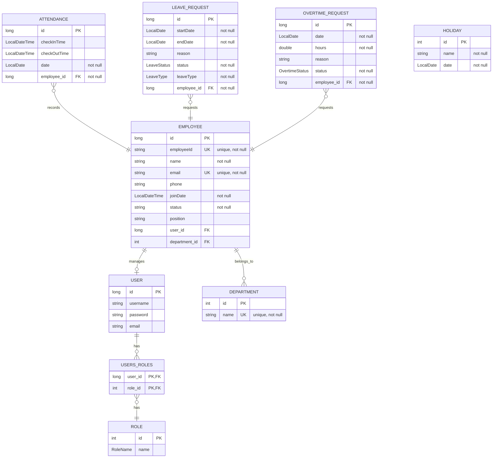

```mermaid
erDiagram
    USER ||--o{ USERS_ROLES : has
    USERS_ROLES }o--|| ROLE : has

    EMPLOYEE ||--o| USER : manages
    EMPLOYEE ||--o{ DEPARTMENT : belongs_to

    ATTENDANCE }o--|| EMPLOYEE : records
    LEAVE_REQUEST }o--|| EMPLOYEE : requests
    OVERTIME_REQUEST }o--|| EMPLOYEE : requests

    USER {
        long id PK
        string username
        string password
        string email
    }

    ROLE {
        int id PK
        RoleName name
    }

    DEPARTMENT {
        int id PK
        string name UK "unique, not null"
    }

    EMPLOYEE {
        long id PK
        string employeeId UK "unique, not null"
        string name "not null"
        string email UK "unique, not null"
        string phone
        LocalDateTime joinDate "not null"
        string status "not null"
        string position
        long user_id FK
        int department_id FK
    }

    HOLIDAY {
        int id PK
        string name "not null"
        LocalDate date "not null"
    }

    ATTENDANCE {
        long id PK
        LocalDateTime checkInTime
        LocalDateTime checkOutTime
        LocalDate date "not null"
        long employee_id FK "not null"
    }

    LEAVE_REQUEST {
        long id PK
        LocalDate startDate "not null"
        LocalDate endDate "not null"
        string reason
        LeaveStatus status "not null"
        LeaveType leaveType "not null"
        long employee_id FK "not null"
    }

    OVERTIME_REQUEST {
        long id PK
        LocalDate date "not null"
        double hours "not null"
        string reason
        OvertimeStatus status "not null"
        long employee_id FK "not null"
    }

    USERS_ROLES {
        long user_id PK,FK
        int role_id PK,FK
    }
```
